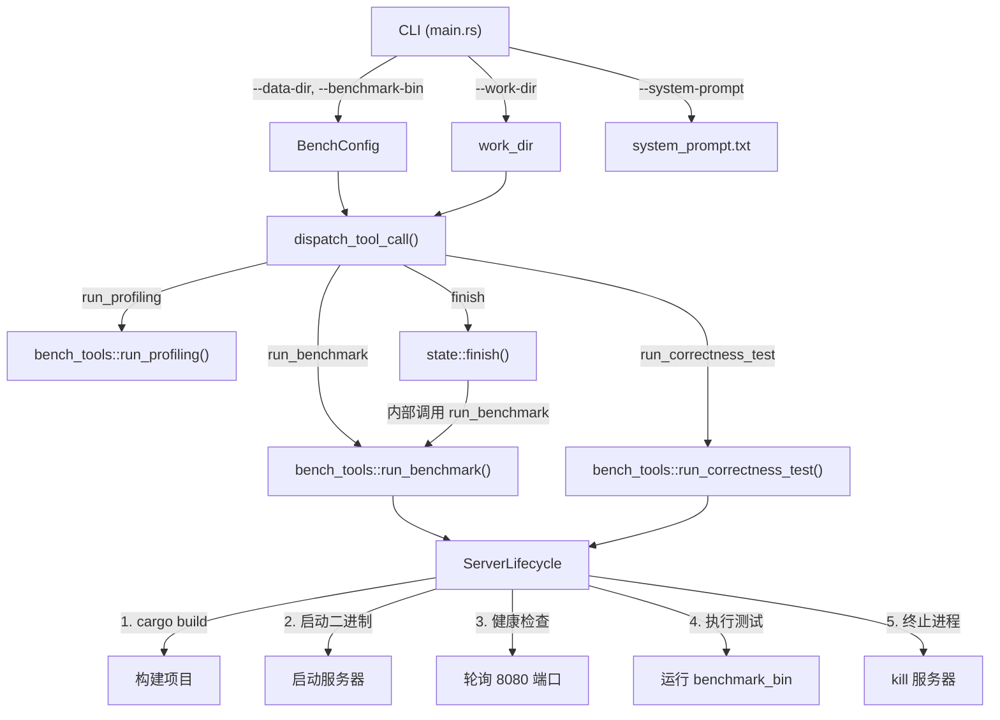

# 设计文档

## 概述

本设计优化 Vector DB Bench Agent 框架，核心目标是消除模型在环境探索上的工具调用浪费。通过三个层面的改进实现：

1. **路径配置化**：通过 CLI 参数 `--data-dir` 和 `--benchmark-bin` 将外部资源路径注入 Agent，消除模型需要自行定位这些资源的需求
2. **服务器自动生命周期管理**：`run_benchmark` 和 `run_correctness_test` 自动处理 cargo build → 启动服务器 → 健康检查 → 执行测试 → 停止服务器的完整流程
3. **系统提示词优化**：明确告知模型环境信息和工具能力，引导模型专注于实现和优化

## 架构



### 数据流

1. `main.rs` 解析 CLI 参数，构造 `BenchConfig` 结构体
2. `BenchConfig` 通过 `dispatch_tool_call` 传递给 `bench_tools` 函数
3. `bench_tools` 函数使用 `BenchConfig` 中的路径定位 benchmark 二进制和数据文件
4. 服务器生命周期由 `bench_tools` 内部的辅助函数自动管理
5. `state::finish()` 接收 `BenchConfig` 以便内部调用 `run_benchmark`

## 组件与接口

### 1. BenchConfig 结构体

新增配置结构体，封装 bench_tools 所需的外部路径配置。

```rust
/// bench_tools 的外部路径配置
#[derive(Debug, Clone)]
pub struct BenchConfig {
    /// benchmark 二进制文件的绝对路径
    pub benchmark_bin: PathBuf,
    /// 数据目录的绝对路径（包含 base_vectors、query_vectors、ground_truth）
    pub data_dir: PathBuf,
}
```

定义位置：`agent/src/bench_tools.rs` 顶部

### 2. CLI 参数扩展 (main.rs)

在 `Args` 结构体中新增两个可选参数：

```rust
/// Path to benchmark binary
#[arg(long)]
benchmark_bin: Option<String>,

/// Path to data directory
#[arg(long)]
data_dir: Option<String>,
```

默认值逻辑在 `main()` 中处理：
- `benchmark_bin` 默认为 `{work_dir}/benchmark/target/release/vector-db-benchmark`
- `data_dir` 默认为 `{work_dir}/data`

启动时验证路径存在性，不存在则报错退出。

### 3. bench_tools 函数签名变更

```rust
pub async fn run_benchmark(
    work_dir: &Path,
    config: &BenchConfig,
    concurrency: Option<usize>,
    warmup: Option<usize>,
) -> ToolResult

pub async fn run_correctness_test(
    work_dir: &Path,
    config: &BenchConfig,
) -> ToolResult
```

移除原有的 `base_dir` 参数语义（之前 base_dir 同时用于定位 benchmark 二进制和数据文件），改为 `work_dir`（项目构建和服务器启动目录）+ `config`（外部资源路径）。

### 4. 服务器生命周期管理

新增内部辅助函数：

```rust
/// 构建项目
async fn build_project(work_dir: &Path) -> Result<(), String>

/// 启动服务器并返回子进程句柄
async fn start_server(work_dir: &Path) -> Result<tokio::process::Child, String>

/// 等待服务器就绪（轮询 HTTP 端口）
async fn wait_for_server_ready(port: u16, timeout_secs: u64, poll_interval_ms: u64) -> Result<(), String>

/// 终止服务器进程并确保端口释放
async fn kill_server(child: &mut tokio::process::Child)

/// 清理占用指定端口的进程
async fn kill_process_on_port(port: u16)
```

`run_benchmark` 和 `run_correctness_test` 的内部流程变为：

```
1. kill_process_on_port(8080)        // 清理残留进程
2. build_project(work_dir)           // cargo build --release
3. start_server(work_dir)            // 启动 target/release/vector-db-skeleton
4. wait_for_server_ready(8080, 30, 200)  // 轮询健康检查
5. 执行 benchmark_bin（传入 config 中的数据路径）
6. kill_server(child)                // 无论成功失败都终止服务器
```

### 5. dispatch_tool_call 签名变更

```rust
pub async fn dispatch_tool_call(
    call: &ToolCall,
    work_dir: &Path,
    config: &BenchConfig,
    state: &mut AgentState,
) -> ToolResult
```

新增 `config` 参数，传递给 `run_benchmark`、`run_correctness_test` 和 `state.finish()`。

### 6. state::finish 签名变更

```rust
pub async fn finish(
    &mut self,
    work_dir: &Path,
    config: &BenchConfig,
    summary: &str,
) -> ToolResult
```

### 7. 数据文件发现逻辑

bench_tools 需要处理两种数据布局：
- 单文件：`{data_dir}/base_vectors.json`
- 分片文件：`{data_dir}/base_vectors_0.json` 到 `{data_dir}/base_vectors_N.json`

由于 benchmark 二进制的 `--base-vectors` 参数只接受单个文件路径，bench_tools 需要：
1. 优先查找 `base_vectors.json`
2. 如果不存在，查找分片文件并合并为临时的 `base_vectors.json`（或在 work_dir 中生成合并文件）

实际上，查看 benchmark 的 loader 代码，它只支持单文件加载。因此设计方案为：
- 如果 `data_dir` 中存在 `base_vectors.json`，直接使用
- 如果只有分片文件，在 `work_dir` 中生成合并后的 `base_vectors_merged.json`，然后传给 benchmark

### 8. 系统提示词更新

更新 `agent/system_prompt.txt`，新增以下关键信息：

1. 明确 work_dir 是所有操作的根目录
2. 说明 `run_benchmark` 和 `run_correctness_test` 自动处理构建和服务器管理
3. 说明数据和 benchmark 二进制由工具自动管理
4. 提供工具调用分配建议
5. 列出 work_dir 初始文件结构

## 数据模型

### BenchConfig

| 字段 | 类型 | 说明 |
|------|------|------|
| benchmark_bin | PathBuf | benchmark 二进制文件绝对路径 |
| data_dir | PathBuf | 数据目录绝对路径 |

### 服务器生命周期常量

| 常量 | 值 | 说明 |
|------|-----|------|
| SERVER_PORT | 8080 | 服务器监听端口 |
| SERVER_READY_TIMEOUT_SECS | 30 | 服务器就绪超时时间 |
| SERVER_POLL_INTERVAL_MS | 200 | 健康检查轮询间隔 |
| BUILD_TIMEOUT_SECS | 300 | cargo build 超时时间 |


## 正确性属性

*正确性属性是一种在系统所有有效执行中都应成立的特征或行为——本质上是关于系统应该做什么的形式化陈述。属性是人类可读规范与机器可验证正确性保证之间的桥梁。*

### Property 1: BenchConfig 路径传播

*For any* 有效的 benchmark_bin 路径和 data_dir 路径，通过 CLI 参数构造的 BenchConfig 应包含与输入完全一致的路径值。

**Validates: Requirements 1.1, 1.2**

### Property 2: 默认路径解析

*For any* work_dir 路径，当 data_dir 和 benchmark_bin 未指定时，解析后的默认路径应分别等于 `{work_dir}/data` 和 `{work_dir}/benchmark/target/release/vector-db-benchmark`。

**Validates: Requirements 1.3, 1.4**

### Property 3: 无效路径验证

*For any* 不存在的文件系统路径，路径验证函数应返回错误，且错误信息中应包含该路径字符串。

**Validates: Requirements 1.5, 1.6**

### Property 4: 服务器健康检查轮询

*For any* 在超时时间内变为可用的 TCP 端口，`wait_for_server_ready` 函数应返回成功；对于在超时时间内始终不可用的端口，应返回超时错误。

**Validates: Requirements 2.3, 2.4**

### Property 5: 服务器清理保证

*For any* `run_benchmark` 或 `run_correctness_test` 的执行（无论成功或失败），执行完成后不应有进程监听在 8080 端口上。

**Validates: Requirements 2.6**

### Property 6: 数据文件发现

*For any* 包含 `base_vectors.json` 单文件或 `base_vectors_N.json` 分片文件的数据目录，数据文件发现函数应返回正确的文件路径，且优先使用单文件。

**Validates: Requirements 3.4, 3.5**

## 错误处理

| 错误场景 | 处理方式 |
|----------|---------|
| CLI 指定的 data_dir 不存在 | 启动时打印错误信息，进程以退出码 1 退出 |
| CLI 指定的 benchmark_bin 不存在 | 启动时打印错误信息，进程以退出码 1 退出 |
| `cargo build --release` 失败 | 返回 `ToolResult::Error`，包含 stderr 中的编译错误信息 |
| 服务器启动后健康检查超时 | 终止服务器进程，返回 `ToolResult::Error`，包含超时信息 |
| 端口 8080 被占用 | 先尝试终止占用端口的进程，再启动服务器 |
| benchmark 二进制执行失败 | 终止服务器进程，返回 `ToolResult::Error`，包含 benchmark 的 stderr |
| 数据目录中找不到 base_vectors 文件 | 返回 `ToolResult::Error`，说明缺少数据文件 |
| 服务器进程在测试过程中意外退出 | 检测到进程退出后返回错误，包含服务器的 stderr 输出 |

## 测试策略

### 属性测试（Property-Based Testing）

使用 `proptest` crate 作为属性测试库。每个属性测试运行至少 100 次迭代。

每个正确性属性对应一个独立的属性测试：

- **Property 1 测试**: 生成随机路径字符串，验证 BenchConfig 构造的正确性
  - Tag: **Feature: agent-framework-optimization, Property 1: BenchConfig 路径传播**
- **Property 2 测试**: 生成随机 work_dir 路径，验证默认值解析逻辑
  - Tag: **Feature: agent-framework-optimization, Property 2: 默认路径解析**
- **Property 3 测试**: 生成随机不存在的路径，验证错误返回
  - Tag: **Feature: agent-framework-optimization, Property 3: 无效路径验证**
- **Property 4 测试**: 使用不同的超时和端口配置，验证健康检查行为
  - Tag: **Feature: agent-framework-optimization, Property 4: 服务器健康检查轮询**
- **Property 6 测试**: 生成包含不同文件布局的临时目录，验证文件发现逻辑
  - Tag: **Feature: agent-framework-optimization, Property 6: 数据文件发现**

### 单元测试

单元测试覆盖具体示例和边界情况：

- `build_project` 在无效目录上返回错误
- `kill_process_on_port` 在无进程占用时不报错
- `BenchConfig` 的 Clone 和 Debug trait 正常工作
- 系统提示词包含关键信息段落（字符串包含检查）
- `run_eval.sh` 包含 `--data-dir` 和 `--benchmark-bin` 参数

### 集成测试

- 端到端测试：使用一个简单的 echo HTTP 服务器验证完整的生命周期管理流程（构建 → 启动 → 健康检查 → 停止）
- Property 5（服务器清理保证）作为集成测试实现，因为需要真实的进程管理

### 测试配置

- 属性测试库：`proptest`（添加到 `[dev-dependencies]`）
- 每个属性测试最少 100 次迭代
- 每个测试用注释标注对应的设计文档属性编号
