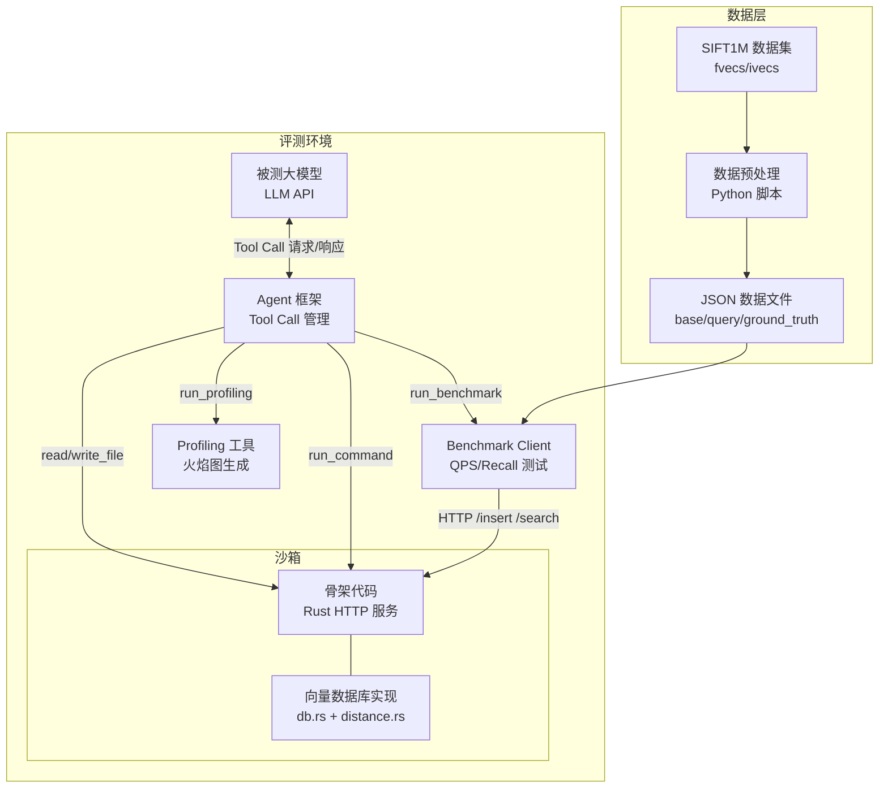
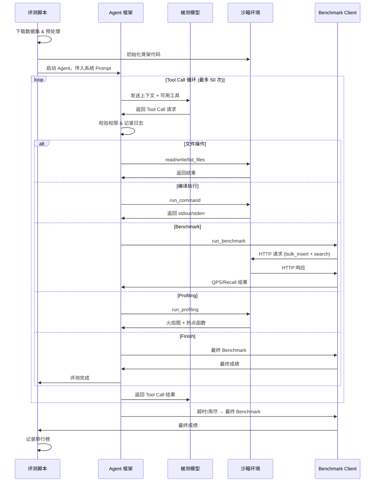
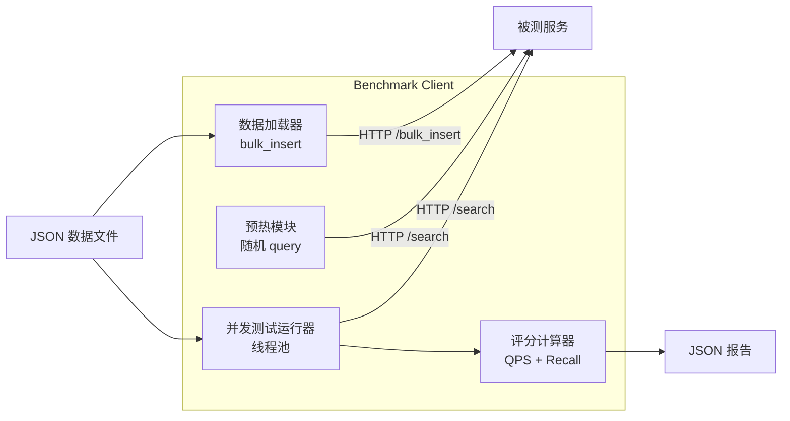
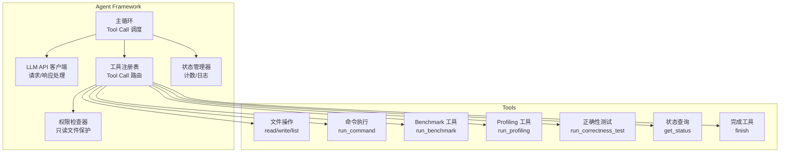

# 设计文档

## 概述

Vector DB Bench 是一个大模型后端代码能力评测系统，由以下核心组件构成：

1. **骨架代码（Skeleton）**：提供给被测模型的 Rust 项目模板，包含固定的 HTTP API 路由和类型定义
2. **Benchmark Client**：标准化的性能测试客户端，负责数据加载、并发查询、QPS/recall 计算
3. **Agent 框架**：Tool Call Agent 运行时，管理模型与环境的交互
4. **数据预处理脚本**：将 SIFT1M 数据集从二进制格式转换为 JSON 格式
5. **评测流程编排**：端到端的自动化评测脚本

系统使用 Rust 作为被测服务和 Benchmark Client 的实现语言，Python 用于数据预处理脚本，Agent 框架使用 Rust 实现。

## 架构

### 系统架构图



### 评测流程时序图



## 组件与接口

### 1. 骨架代码（Skeleton）

骨架代码是一个完整的 Rust 项目，使用 axum 作为 HTTP 框架。

#### 项目结构

```
skeleton/
├── Cargo.toml              # 项目配置（模型可修改 release profile）
└── src/
    ├── main.rs             # HTTP 服务入口 + 路由定义（只读）
    ├── api.rs              # 请求/响应类型定义（只读）
    ├── db.rs               # VectorDB 核心实现（模型实现区域）
    └── distance.rs         # L2 距离计算（模型实现区域）
```

#### 核心接口

```rust
// api.rs - 固定的 API 类型定义（只读）
use serde::{Deserialize, Serialize};

#[derive(Deserialize)]
pub struct InsertRequest {
    pub id: u64,
    pub vector: Vec<f32>,
}

#[derive(Serialize)]
pub struct InsertResponse {
    pub status: String,
}

#[derive(Deserialize)]
pub struct BulkInsertRequest {
    pub vectors: Vec<InsertRequest>,
}

#[derive(Serialize)]
pub struct BulkInsertResponse {
    pub status: String,
    pub inserted: usize,
}

#[derive(Deserialize)]
pub struct SearchRequest {
    pub vector: Vec<f32>,
    pub top_k: u32,
}

#[derive(Serialize)]
pub struct SearchResult {
    pub id: u64,
    pub distance: f64,
}

#[derive(Serialize)]
pub struct SearchResponse {
    pub results: Vec<SearchResult>,
}
```

```rust
// db.rs - 模型实现区域（提供桩代码）
use crate::api::*;

pub struct VectorDB {
    // 模型自行定义内部数据结构
}

impl VectorDB {
    pub fn new() -> Self {
        todo!("模型实现")
    }

    pub fn insert(&self, id: u64, vector: Vec<f32>) {
        todo!("模型实现")
    }

    pub fn bulk_insert(&self, vectors: Vec<(u64, Vec<f32>)>) -> usize {
        todo!("模型实现")
    }

    pub fn search(&self, vector: &[f32], top_k: u32) -> Vec<SearchResult> {
        todo!("模型实现")
    }
}
```

```rust
// distance.rs - 模型实现区域
pub fn l2_distance(a: &[f32], b: &[f32]) -> f64 {
    todo!("模型实现")
}
```

```rust
// main.rs - HTTP 服务入口（只读）
use axum::{routing::post, Router, Json, extract::State};
use std::sync::Arc;
use tokio::net::TcpListener;

mod api;
mod db;
mod distance;

use api::*;
use db::VectorDB;

#[tokio::main]
async fn main() {
    let db = Arc::new(VectorDB::new());
    
    let app = Router::new()
        .route("/insert", post(handle_insert))
        .route("/bulk_insert", post(handle_bulk_insert))
        .route("/search", post(handle_search))
        .with_state(db);

    let listener = TcpListener::bind("0.0.0.0:8080").await.unwrap();
    axum::serve(listener, app).await.unwrap();
}

async fn handle_insert(
    State(db): State<Arc<VectorDB>>,
    Json(req): Json<InsertRequest>,
) -> Json<InsertResponse> {
    db.insert(req.id, req.vector);
    Json(InsertResponse { status: "ok".to_string() })
}

async fn handle_bulk_insert(
    State(db): State<Arc<VectorDB>>,
    Json(req): Json<BulkInsertRequest>,
) -> Json<BulkInsertResponse> {
    let vectors: Vec<(u64, Vec<f32>)> = req.vectors
        .into_iter()
        .map(|v| (v.id, v.vector))
        .collect();
    let count = db.bulk_insert(vectors);
    Json(BulkInsertResponse { status: "ok".to_string(), inserted: count })
}

async fn handle_search(
    State(db): State<Arc<VectorDB>>,
    Json(req): Json<SearchRequest>,
) -> Json<SearchResponse> {
    let results = db.search(&req.vector, req.top_k);
    Json(SearchResponse { results })
}
```


### 2. Benchmark Client

Benchmark Client 是独立的 Rust 程序，使用 tokio + reqwest 实现并发 HTTP 请求。

#### 架构



#### 核心流程

```rust
// benchmark 伪代码
struct BenchmarkConfig {
    server_url: String,       // 默认 "http://127.0.0.1:8080"
    concurrency: usize,       // 默认 4
    warmup_count: usize,      // 默认 1000
    base_vectors_path: String,
    query_vectors_path: String,
    ground_truth_path: String,
}

struct BenchmarkResult {
    qps: f64,
    total_queries: usize,
    duration_secs: f64,
    avg_latency_ms: f64,
    p50_latency_ms: f64,
    p95_latency_ms: f64,
    p99_latency_ms: f64,
    recall: f64,
    recall_threshold: f64,
    recall_passed: bool,
    concurrency: usize,
}

async fn run_benchmark(config: BenchmarkConfig) -> BenchmarkResult {
    // 1. 加载 base vectors，通过 /bulk_insert 批量插入
    // 2. 加载 query vectors 和 ground truth
    // 3. 预热：随机选取 warmup_count 条 query 发送 /search
    // 4. 使用随机种子打乱 query 顺序
    // 5. 创建线程池（concurrency 个线程）
    // 6. 分发 query 到线程池，记录每个请求的延迟和结果
    // 7. 计算 QPS、延迟分位数、recall
    // 8. 输出 JSON 格式结果
}
```

#### Recall 计算逻辑

```rust
fn calculate_recall(
    model_results: &[Vec<u64>],    // 每条 query 的模型返回 top-10 ID
    ground_truth: &[Vec<u64>],     // 每条 query 的 ground truth top-10 ID
) -> f64 {
    let total: f64 = model_results.iter()
        .zip(ground_truth.iter())
        .map(|(model, truth)| {
            let model_set: HashSet<u64> = model.iter().copied().collect();
            let truth_set: HashSet<u64> = truth.iter().take(10).copied().collect();
            let intersection = model_set.intersection(&truth_set).count();
            intersection as f64 / 10.0
        })
        .sum();
    total / model_results.len() as f64
}
```

### 3. Agent 框架

Agent 框架负责管理模型与评测环境的交互。

#### 架构



#### Tool Call 接口定义

```rust
// 工具定义（供 LLM function calling 使用）
enum ToolCall {
    ReadFile { path: String },
    WriteFile { path: String, content: String },
    ListFiles { path: String },
    RunCommand { command: String, timeout: Option<u64> },
    RunBenchmark { concurrency: Option<usize>, warmup: Option<usize> },
    RunProfiling { duration: Option<u64> },
    RunCorrectnessTest,
    GetStatus,
    Finish { summary: String },
}

enum ToolResult {
    ReadFile { content: String },
    WriteFile { status: String, bytes_written: usize },
    ListFiles { files: Vec<String> },
    RunCommand { exit_code: i32, stdout: String, stderr: String, duration_ms: u64 },
    RunBenchmark(BenchmarkResult),
    RunProfiling { flamegraph_svg_path: String, top_functions: Vec<FunctionProfile>, total_samples: u64 },
    RunCorrectnessTest { passed: bool, total_queries: usize, recall: f64, recall_threshold: f64, failed_queries: Vec<u64>, message: String },
    GetStatus(AgentStatus),
    Finish { status: String, final_benchmark: BenchmarkResult },
    Error { message: String },
}
```

#### 状态管理

```rust
struct AgentState {
    tool_calls_used: u32,
    tool_calls_total: u32,        // 固定 50
    start_time: Instant,
    server_running: bool,
    last_benchmark: Option<BenchmarkResult>,
    call_log: Vec<ToolCallLog>,   // 完整的调用日志
}

struct ToolCallLog {
    index: u32,
    tool: String,
    input: serde_json::Value,
    output: serde_json::Value,
    duration_ms: u64,
    timestamp: DateTime<Utc>,
}
```

#### 权限控制

只读文件列表（硬编码在 Agent 框架中）：

```rust
const READONLY_FILES: &[&str] = &[
    "src/main.rs",
    "src/api.rs",
    "benchmark/",          // 整个 benchmark 目录
    "scripts/load_data.py",
];
```

### 4. 数据预处理脚本

#### fvecs/ivecs 格式解析

```
fvecs 格式：每条向量前有一个 4 字节 int32 表示维度
[dim: i32][v0: f32][v1: f32]...[v_{dim-1}: f32][dim: i32][v0: f32]...

ivecs 格式：同 fvecs，但数据类型为 int32
[dim: i32][v0: i32][v1: i32]...[v_{dim-1}: i32]...
```

#### 脚本设计

```python
# download_dataset.py - 下载 SIFT1M 数据集
# 从 HuggingFace 或 corpus-texmex.irisa.fr 下载
# 输出到 data/ 目录

# generate_ground_truth.py - 生成 ground truth
# 读取 base vectors 和 query vectors
# 对每条 query 暴力计算 L2 距离，取 Top-100
# 输出 ground_truth.json

# load_data.py - 数据加载脚本（只读）
# 读取 JSON 格式的 base vectors
# 通过 /bulk_insert 接口批量加载到被测服务
```

#### 输出 JSON 格式

```json
// base_vectors.json（或分片文件）
[
  {"id": 0, "vector": [0.1, 0.2, ...]},
  {"id": 1, "vector": [0.3, 0.4, ...]},
  ...
]

// query_vectors.json
[
  {"id": 0, "vector": [0.5, 0.6, ...]},
  ...
]

// ground_truth.json
[
  {"query_id": 0, "neighbors": [23, 456, 789, ...]},
  ...
]
```

### 5. 评测流程编排（run_eval.sh）

```bash
#!/bin/bash
# 完整评测流程
# 1. 下载数据集（如果不存在）
# 2. 预处理数据（fvecs → JSON）
# 3. 生成 ground truth（如果不存在）
# 4. 初始化骨架代码到工作目录
# 5. 启动 Agent 框架，传入模型配置和系统 Prompt
# 6. Agent 框架管理模型交互（最多 50 次 tool call）
# 7. 收集最终 benchmark 结果
# 8. 更新排行榜
```

## 数据模型

### 向量数据

```rust
// 128 维 float32 向量
type Vector = Vec<f32>;  // len() == 128

// 带 ID 的向量
struct IndexedVector {
    id: u64,
    vector: Vector,
}
```

### Benchmark 结果

```rust
struct BenchmarkResult {
    qps: f64,
    total_queries: usize,
    duration_secs: f64,
    avg_latency_ms: f64,
    p50_latency_ms: f64,
    p95_latency_ms: f64,
    p99_latency_ms: f64,
    recall: f64,
    recall_threshold: f64,  // 默认 0.95
    recall_passed: bool,
    concurrency: usize,
}
```

### Agent 状态

```rust
struct AgentStatus {
    tool_calls_used: u32,
    tool_calls_remaining: u32,
    tool_calls_total: u32,
    elapsed_time_secs: f64,
    server_running: bool,
    last_benchmark: Option<BenchmarkResult>,
}
```

### 排行榜条目

```rust
struct LeaderboardEntry {
    model_name: String,
    qps: f64,
    recall: f64,
    recall_passed: bool,
    tool_calls_used: u32,
    total_time_secs: f64,
    optimization_summary: String,
    timestamp: DateTime<Utc>,
}
```

### 评测日志

```rust
struct EvalLog {
    model_name: String,
    system_prompt: String,
    tool_calls: Vec<ToolCallLog>,
    final_result: BenchmarkResult,
    started_at: DateTime<Utc>,
    finished_at: DateTime<Utc>,
}
```


## 正确性属性

*正确性属性是一种在系统所有有效执行中都应成立的特征或行为——本质上是关于系统应该做什么的形式化陈述。属性是人类可读规范与机器可验证正确性保证之间的桥梁。*

### Property 1: 向量插入-搜索 Round Trip

*For any* 有效的 128 维 float32 向量和唯一 ID，将该向量通过 `/insert` 插入后，使用相同向量调用 `/search`（top_k=10），返回结果中应包含该向量的 ID，且对应距离为 0（或接近 0 的浮点误差范围内）。

**Validates: Requirements 1.2, 1.4**

### Property 2: 搜索结果距离有序性

*For any* 查询向量和已插入的向量集合，`/search` 返回的结果列表中，每个结果的 distance 值应满足非递减顺序（升序排列），即 results[i].distance <= results[i+1].distance。

**Validates: Requirements 1.4**

### Property 3: Bulk Insert 计数一致性

*For any* 包含 N 条有效向量的 bulk_insert 请求，响应中的 `inserted` 字段应等于 N。

**Validates: Requirements 1.3**

### Property 4: Recall 计算正确性

*For any* 模型返回的 Top-10 ID 集合和 Ground Truth Top-10 ID 集合，recall 值应等于两个集合交集大小除以 10，且 recall 值始终在 [0.0, 1.0] 范围内。当两个集合完全相同时，recall 应为 1.0；当两个集合完全不相交时，recall 应为 0.0。

**Validates: Requirements 2.5**

### Property 5: 延迟分位数有序性

*For any* 一组查询延迟数据，计算出的分位数应满足：avg_latency >= 0，且 P50 <= P95 <= P99。

**Validates: Requirements 2.4**

### Property 6: Benchmark 结果序列化 Round Trip

*For any* 有效的 BenchmarkResult 对象，将其序列化为 JSON 后再反序列化，应得到与原始对象等价的结果。

**Validates: Requirements 2.7**

### Property 7: 文件读写 Round Trip

*For any* 有效的文件路径（非只读）和文件内容字符串，通过 `write_file` 写入后再通过 `read_file` 读取，应得到与原始内容相同的字符串。

**Validates: Requirements 3.1, 3.2**

### Property 8: 文件列表包含性

*For any* 目录路径，通过 `write_file` 在该目录下创建文件后，`list_files` 返回的列表应包含该文件名。

**Validates: Requirements 3.3**

### Property 9: Tool Call 计数不变量

*For any* Agent 会话状态，tool_calls_used + tool_calls_remaining 应始终等于 50，且日志条目数应等于 tool_calls_used。

**Validates: Requirements 3.8, 3.10, 3.13**

### Property 10: 只读文件写入保护

*For any* 只读文件列表中的路径，通过 `write_file` 尝试写入时，Agent 框架应返回权限错误，且文件内容保持不变。

**Validates: Requirements 3.12, 7.2**

### Property 11: fvecs/ivecs 解析 Round Trip

*For any* 有效的 128 维 float32 向量集合，将其编码为 fvecs 二进制格式后再解析，应得到与原始向量集合等价的结果。同理，对于 ivecs 格式的整数向量集合也应成立。

**Validates: Requirements 4.1, 4.2, 4.3**

### Property 12: 数据格式转换 Round Trip

*For any* 有效的向量数据，从 fvecs 解析后转换为 JSON 格式，再从 JSON 解析回来，应得到与原始数据等价的结果。

**Validates: Requirements 4.4**

### Property 13: 暴力搜索 Ground Truth 正确性

*For any* 小规模向量数据集和查询向量，暴力搜索返回的 Top-K 最近邻中，每个邻居的 L2 距离应小于等于未被选中的任何向量的 L2 距离。

**Validates: Requirements 4.6**

### Property 14: Recall 不达标时 QPS 归零

*For any* 最终 benchmark 结果，当 recall < 0.95 时，该模型的最终 QPS 分数应为 0。

**Validates: Requirements 5.2**

### Property 15: 排行榜排序正确性

*For any* 排行榜条目集合，排序后应满足：对于相邻的两个条目 A 和 B（A 排名靠前），A.qps >= B.qps；当 A.qps == B.qps 时，A.recall >= B.recall。

**Validates: Requirements 5.3**

### Property 16: Prompt 黑名单关键词检查

*For any* 系统 Prompt 文本和预定义的黑名单关键词列表（包含具体索引算法名称如 HNSW、IVF、PQ、KD-Tree，以及具体优化技术名称如 SIMD、内存池、cache-line、lock-free），Prompt 文本中不应包含任何黑名单关键词。

**Validates: Requirements 5.5, 6.3, 6.4**

### Property 17: Query 顺序随机化

*For any* 两次使用不同随机种子的 benchmark 运行，query 的执行顺序应不同，但最终的 recall 计算结果应相同（因为 recall 与顺序无关）。

**Validates: Requirements 2.6, 5.6, 7.1**

## 错误处理

### 骨架代码错误处理

| 错误场景 | 处理方式 |
|---------|---------|
| 请求体 JSON 格式错误 | 返回 HTTP 400，包含错误描述 |
| 向量维度不等于 128 | 返回 HTTP 400，提示维度错误 |
| top_k 为 0 或负数 | 返回 HTTP 400，提示参数无效 |
| 数据库未初始化 | 返回 HTTP 500，提示服务未就绪 |

### Agent 框架错误处理

| 错误场景 | 处理方式 |
|---------|---------|
| Tool call 次数超过 50 | 自动触发最终 benchmark，结束评测 |
| 写入只读文件 | 返回权限错误，不修改文件 |
| run_command 超时 | 终止进程，返回超时错误 |
| 编译失败 | 返回编译错误信息（stdout + stderr） |
| 被测服务未启动时运行 benchmark | 返回服务不可用错误 |
| LLM API 调用失败 | 重试 3 次，仍失败则记录错误并结束评测 |

### 数据预处理错误处理

| 错误场景 | 处理方式 |
|---------|---------|
| fvecs/ivecs 文件格式错误 | 报告描述性错误信息并终止 |
| 文件不存在 | 报告文件路径错误并终止 |
| 向量维度不一致 | 报告维度不匹配错误并终止 |
| 磁盘空间不足 | 报告空间不足错误并终止 |

### Benchmark Client 错误处理

| 错误场景 | 处理方式 |
|---------|---------|
| 被测服务无响应 | 超时后报告连接错误 |
| 响应 JSON 格式错误 | 记录错误，该 query 标记为失败 |
| 返回结果数量不等于 top_k | 记录警告，按实际返回数量计算 recall |

## 测试策略

### 测试框架选择

- **单元测试**：Rust 内置 `#[test]` + `#[cfg(test)]`
- **属性测试**：[proptest](https://crates.io/crates/proptest) crate（Rust 生态中最成熟的属性测试库）
- **集成测试**：Rust `tests/` 目录 + tokio 异步测试
- **Python 脚本测试**：pytest

### 属性测试配置

- 每个属性测试运行至少 100 次迭代
- 使用 proptest 的 `ProptestConfig` 配置迭代次数
- 每个测试用注释标注对应的设计文档属性编号
- 标注格式：`// Feature: vector-db-bench, Property N: {property_text}`

### 单元测试覆盖

单元测试聚焦于：
- 具体的边界条件和边缘情况（空向量、单条向量、维度不匹配等）
- API 端点的具体请求/响应示例
- 错误处理路径的验证
- 集成点的验证（Agent 调用 Benchmark Client 等）

### 属性测试覆盖

属性测试聚焦于：
- 所有 17 个正确性属性的验证
- 使用 proptest 生成随机向量、随机 ID、随机文件内容等
- 每个正确性属性对应一个独立的属性测试函数

### 测试分层

```
单元测试（快速，具体示例）
  ├── API 类型序列化/反序列化
  ├── L2 距离计算的已知值
  ├── Recall 计算的已知值
  └── 错误处理路径

属性测试（全面，随机输入）
  ├── Property 1-3: 向量插入/搜索正确性
  ├── Property 4-6: Benchmark 计算正确性
  ├── Property 7-9: Agent 框架工具正确性
  ├── Property 10: 权限控制
  ├── Property 11-13: 数据处理正确性
  ├── Property 14-15: 评分和排行榜
  ├── Property 16: Prompt 公平性
  └── Property 17: 随机化

集成测试（端到端流程）
  ├── 完整的 benchmark 流程
  ├── Agent 会话模拟
  └── 数据预处理流程
```
